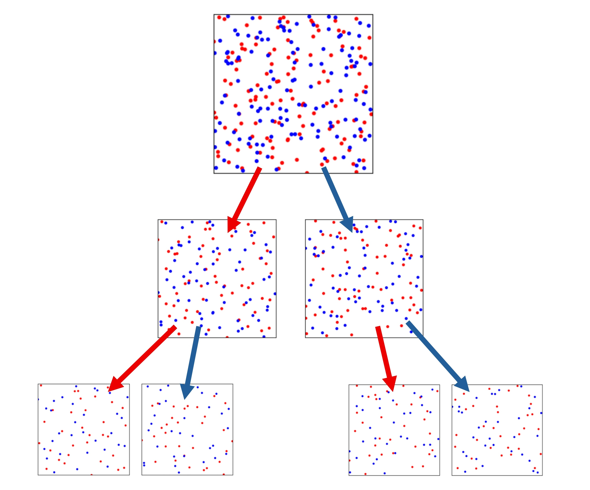

# QMC_SubgTrans
Implementation of SubgTrans and WSubgTrans for quasi-Monte Carlo constructions via combinatorial discrepancy.

# Illustration of Method



## Installation

Clone the repository and install dependencies:

```bash
git clone https://github.com/yourusername/QMC_SubgTrans.git
cd QMC_SubgTrans
pip install -r requirements.txt
```

## Example Usage

You can run the SubgTrans construction from the terminal with custom parameters. For example, to generate 32 points in 10 dimensions using the truncation family with truncation effective dimension 2:

```bash
python subgtrans.py -n 32 -d 10 -family truncation -s 2 -gamma 1 1 0 0 0 0 0 0 0 0
```

**Parameters:**
- `-n`: Number of points per set (must be a power of two)
- `-d`: Dimension
- `-family`: Feature family (`unweighted`, `weighted`, `superposition`, `truncation`)
- `-gamma`: Product weights for the `weighted` family (space-separated list)
- `-s`: Order for `superposition` or leading dims for `truncation`
- `-h`: Dyadic depth (optional)
- `-init`: Initialization mode (`n2` or `k`)
- `-k`: Value for `init='k'` (must be a power of two)
- `-sampler`: Initial sampler (`uniform` or `sobol`)
- `-shift`: Apply random shift (flag)
- `-seed`: Random seed
- `-max_boxes`: Maximum number of boxes (features)

**Example for superposition family:**
```bash
python subgtrans.py -n 256 -d 32 -family superposition -s 2
```

## Citation
If you find this useful, please consider referencing our work and related work:

```bibtex
@misc{chen2025,
      title={High-Dimensional Quasi-Monte Carlo via Combinatorial Discrepancy}, 
      author={Jiaheng Chen and Haotian Jiang and Nathan Kirk},
      year={2025},
      eprint={2508.18426},
      archivePrefix={arXiv},
      primaryClass={math.NA},
      url={https://arxiv.org/abs/2508.18426}, 
}

and

@inproceedings{Bansal2025,
  title={Quasi-Monte Carlo Beyond Hardy-Krause},
  author={Bansal, N. and Jiang, H.},
  booktitle={Proceedings of the 2025 Annual ACM-SIAM Symposium on Discrete Algorithms (SODA)},
  pages={2051--2075},
  year={2025},
  organization={SIAM}
}
